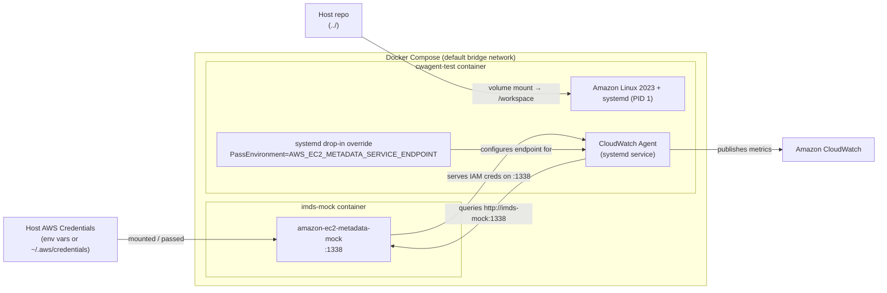

# Local Development Environment

Docker Compose-based local environment that simulates an EC2 instance for running the CloudWatch Agent locally without real AWS infrastructure.

## Architecture



## How It Works

The `cwagent-test` container runs Amazon Linux 2023 with systemd as PID 1 in privileged mode with cgroup access. This is required because the CloudWatch Agent is managed as a systemd service and `amazon-cloudwatch-agent-ctl` expects systemd to be available.

The `imds-mock` container runs [amazon-ec2-metadata-mock](https://github.com/aws/amazon-ec2-metadata-mock) v1.13.0 on busybox, simulating the EC2 Instance Metadata Service (IMDS). On startup, its entrypoint script reads real AWS credentials from environment variables or the mounted `~/.aws/credentials` file and injects them into the mock metadata responses. This preserves the production credential flow — the agent discovers credentials through IMDS rather than having them injected directly.

A systemd drop-in override (`/etc/systemd/system/amazon-cloudwatch-agent.service.d/override.conf`) passes `AWS_EC2_METADATA_SERVICE_ENDPOINT=http://imds-mock:1338` to the agent service, directing credential lookups to the mock.

The entire repo is mounted at `/workspace` inside `cwagent-test`, so changes are immediately available without rebuilding. Only agent source code changes require an RPM rebuild.

Simulated metadata defaults:

| Field | Value |
|-------|-------|
| instance-id | `i-1234567890abcdef0` |
| instance-type | `m5.xlarge` |
| region | `us-east-1` |
| availability-zone | `us-east-1a` |

## Prerequisites

- Docker and docker-compose
- The [amazon-cloudwatch-agent](https://github.com/aws/amazon-cloudwatch-agent) source repo cloned as a sibling directory (`../../amazon-cloudwatch-agent` relative to `localtest/`), or set the `AGENT_REPO` environment variable to its path
- AWS credentials available via environment variables (`AWS_ACCESS_KEY_ID`, `AWS_SECRET_ACCESS_KEY`, optionally `AWS_SESSION_TOKEN`) or `~/.aws/credentials`
- Go toolchain (for building the agent RPM)

## Quick Start

```bash
cd localtest
./build.sh
```

`build.sh` performs the following steps:

1. Detects CPU architecture (`amd64` or `arm64`)
2. Validates that `AGENT_REPO` points to a valid directory
3. Runs `make amazon-cloudwatch-agent-linux package-rpm` in the agent repo
4. Copies the built RPM to `.build/`
5. Runs `docker-compose build` then `docker-compose up -d`

## Interacting with the Environment

Attach to the container:

```bash
docker-compose exec cwagent-test bash
```

Start the agent with a config:

```bash
sudo /opt/aws/amazon-cloudwatch-agent/bin/amazon-cloudwatch-agent-ctl \
  -a fetch-config -m ec2 -s -c file:<config_path>
```

Stop the agent:

```bash
sudo /opt/aws/amazon-cloudwatch-agent/bin/amazon-cloudwatch-agent-ctl -a stop
```

Check agent status:

```bash
sudo /opt/aws/amazon-cloudwatch-agent/bin/amazon-cloudwatch-agent-ctl -a status
```

View agent logs:

```bash
tail -f /opt/aws/amazon-cloudwatch-agent/logs/amazon-cloudwatch-agent.log
```

Stop the environment:

```bash
docker-compose down
```

Rebuild after agent code changes:

```bash
# Full rebuild (builds RPM from source)
./build.sh

# If RPM is already in .build/
docker-compose build && docker-compose up -d
```

## Environment Variables

| Variable | Description | Default |
|----------|-------------|---------|
| `AGENT_REPO` | Path to amazon-cloudwatch-agent source repo | `../../amazon-cloudwatch-agent` |
| `AWS_ACCESS_KEY_ID` | AWS credential for IMDS mock | Falls back to `~/.aws/credentials` |
| `AWS_SECRET_ACCESS_KEY` | AWS credential for IMDS mock | Falls back to `~/.aws/credentials` |
| `AWS_SESSION_TOKEN` | Optional session token for IMDS mock | *(none)* |
| `IMDS_INSTANCE_ID` | Simulated EC2 instance ID | `i-1234567890abcdef0` |
| `IMDS_INSTANCE_TYPE` | Simulated EC2 instance type | `m5.xlarge` |
| `IMDS_REGION` | Simulated AWS region | `us-east-1` |
| `IMDS_AVAILABILITY_ZONE` | Simulated availability zone | `us-east-1a` |

## Directory Structure

```
localtest/
├── docker-compose.yml    # Defines imds-mock and cwagent-test services
├── Dockerfile            # Amazon Linux 2023 container with systemd + Go + CWAgent
├── build.sh              # Builds agent RPM from source and starts containers
├── .gitignore            # Ignores .build/ directory
├── .build/               # Contains compiled amazon-cloudwatch-agent.rpm (gitignored)
└── imds/
    ├── Dockerfile        # Multi-stage build using amazon-ec2-metadata-mock v1.13.0
    └── entrypoint.sh     # Credential injection script for IMDS mock
```

## Notes

- Changes in the repo are reflected immediately via the volume mount, but agent code changes require rebuilding the RPM via `build.sh`.
- The container runs in privileged mode with cgroup access — this is required for systemd.
