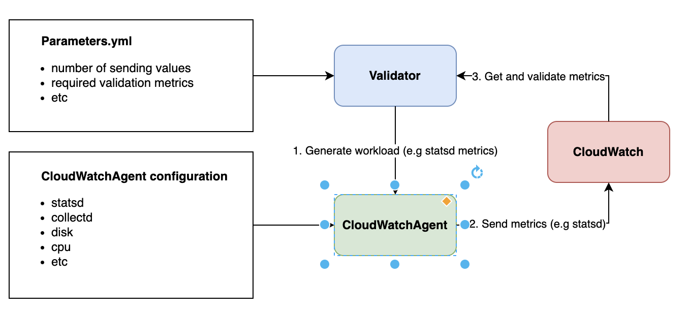

# Validator

Validator is used to get the generator configuration (e.g [statsd stress parameters.yml](https://github.com/aws/amazon-cloudwatch-agent-test/blob/2c859b71d067e482985b9c57ca2d2617de8a7795/test/stress/statsd/parameters.yml)) to generate the required loads (e.g 1000 statsd metrics, 1000 logs for a single log file, etc) to CloudWatchAgent and get the required [metrics/logs/traces](https://github.com/aws/amazon-cloudwatch-agent-test/blob/2c859b71d067e482985b9c57ca2d2617de8a7795/test/stress/statsd/parameters.yml#L20-L64) for validation and validate with an appropriate action (e.g [stress validates](https://github.com/aws/amazon-cloudwatch-agent-test/blob/2c859b71d067e482985b9c57ca2d2617de8a7795/validator/validators/validator.go#L20-L21) the required metrics [within bounds](https://github.com/aws/amazon-cloudwatch-agent-test/blob/2c859b71d067e482985b9c57ca2d2617de8a7795/validator/validators/stress/stress_validator.go#L199-L245))

## Architectural


## Validator Type

| Name             | Description                                                                                                      |
|------------------| -----------------------------------------------------------------------------------------------------------------|
|`basic`           | Validate metrics/logs/traces for a single plugin/use case/feature (also validate json schema within the log stream)                                                                                                                               |
|`feature`         | Sanity all the features/ plugins for a single OS instead of a single plugin/feature at a time (basic)            |
|`containerinsight`| Validate metrics/logs for container insight plugins/ use case. For all the supported metrics need to be validate in container insight, please follow [this document](https://docs.aws.amazon.com/AmazonCloudWatch/latest/monitoring/Container-Insights-metrics.html)         |
|`performance`     | [Record CloudWatchAgent's performance metrics](https://github.com/aws/amazon-cloudwatch-agent-test/tree/main/validator/validators/performance//performance_validator.go) by using procstat (e.g cpu_usage) and send it to DynamoDB.                                     |
|`stress`          | [Record CloudWatchAgent's performance metrics](https://github.com/aws/amazon-cloudwatch-agent-test/blob/main/validator/validators/stress/stress_validator.go) when sending high metrics/logs/traces loads and ensure the performance stays consistent between releases. |   

## Validator Configuration

The following receiver configuration parameters are supported.

| Name               | Description                                                                                                   | Default |
|--------------------| --------------------------------------------------------------------------------------------------------------|---------|
|`preparation-mode`  | the option  to prepare the appropriate action for CloudWatchAgent before running CloudWatchAgent (e.g inject [dynamically 1000 log file for CloudWatchAgent to monitor](https://github.com/aws/amazon-cloudwatch-agent-test/blob/2c859b71d067e482985b9c57ca2d2617de8a7795/validator/main.go#L69-L83)| "false" |


## Run as a command
```
go run ./validator/main.go --validator-config=/tmp/parameters.yml --preparation-mode=true
```

## Add a validation suite

**Step 1:** Add a `parameters.yml` to generate the generator config (e.g [statsd](https://github.com/aws/amazon-cloudwatch-agent-test/blob/2c859b71d067e482985b9c57ca2d2617de8a7795/test/stress/statsd/parameters.yml)). For full configuration of generator configuration, here are [all the configuration options](https://github.com/aws/amazon-cloudwatch-agent-test/blob/main/validator/models/validation_config.go#L36)

**Step 2:** Add an CloudWatchAgent json configuration that runs along with the validator (e.g [statsd](https://github.com/aws/amazon-cloudwatch-agent-test/blob/2c859b71d067e482985b9c57ca2d2617de8a7795/test/stress/statsd/agent_config.json))
